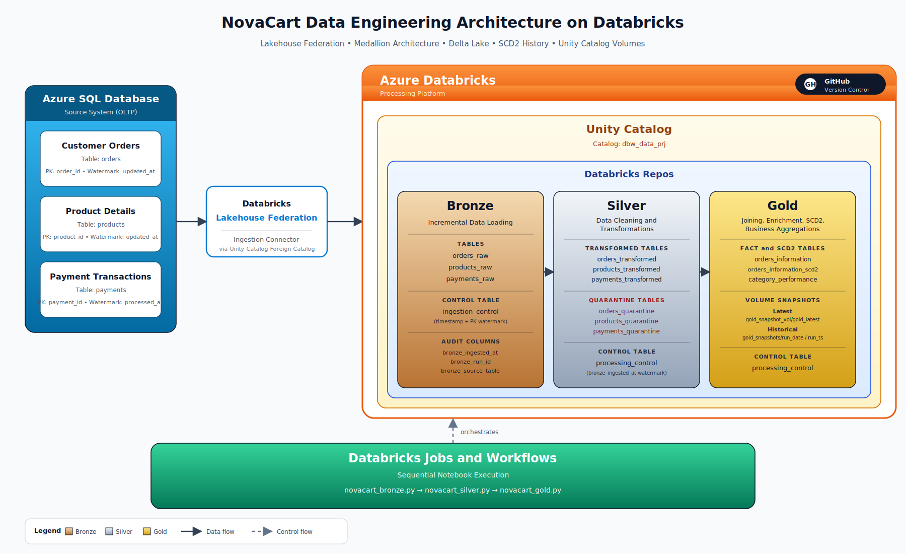
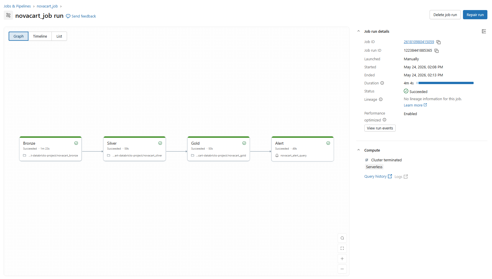

# NovaCart Data Engineering Project: An Incremental Order to Insight Pipeline on Databricks

This project implements a fully incremental **End to End Data Engineering Pipeline** on the **Databricks Lakehouse Platform** for **NovaCart**, an online retailer whose orders, products, and payments flow from an **Azure SQL Database** into a unified, governed analytical layer. It leverages **Databricks Lakehouse Federation**, the **Medallion Architecture**, **Delta Lake**, **Unity Catalog**, **SCD Type 2**, and **Databricks Workflows** to deliver reliable, watermark driven, and business ready Gold tables along with audit ready snapshots on a Unity Catalog Volume.

---

## 🎯 Project Goals & Business Solution

### Business Overview

* **NovaCart (Online Retailer):** NovaCart processes a continuous stream of customer orders, product updates, and payment transactions every day. The transactional data is captured in an Azure SQL Database (OLTP) and used by operations and finance teams for daily reconciliation, payment investigation, and category performance reviews.
* **Analytical Gap:** The OLTP source is not built for heavy analytical scans or for tracking historical changes. Querying the source database directly puts pressure on the transactional system, misses historical changes such as price corrections and payment status updates, and offers no isolation between data quality issues and downstream consumers.

### Management Expectation

The management requires a **single source of truth** for NovaCart order analytics that captures every change to orders, products, and payments, isolates bad records, tracks history through SCD2, and publishes governed Gold outputs to a Unity Catalog Volume without touching the source database.

### Data Engineering Solution

The Data Engineering team builds a fully **incremental pipeline** that uses **Databricks Lakehouse Federation** to read directly from the Azure SQL Database, lands raw rows in the **Bronze layer**, cleans and validates them in the **Silver layer** while quarantining bad rows, and then **joins, enriches, and historizes** the order grain in the **Gold layer**. The Gold layer maintains an SCD2 history table, category level aggregations, and timestamped snapshots on a Databricks Volume. The full chain is orchestrated by **Databricks Jobs and Workflows**.

---

## 🌟 Project Highlights

* **Lakehouse Federation Ingestion:** Reads the three source tables directly from Azure SQL Database through a Unity Catalog foreign catalog, with no external file staging.
* **Watermark Driven Bronze Layer:** A dual key watermark on `(timestamp, primary_key)` and an `ingestion_control` Delta table make every Bronze run incremental and rerun safe.
* **Silver Layer Standardization and Quarantine:** Row level deduplication using `row_number()` windows, business rule validation, and a dedicated quarantine table for rows that fail data quality checks.
* **Gold Layer with SCD Type 2 History:** Impacted order detection across Orders, Products, and Payments drives targeted Gold rebuilds. Historical changes are captured in `orders_information_scd2` so analysts can see what a record looked like at any point in time.
* **Category Aggregations:** A `category_performance` table maintains Gross Merchandise Value, total orders, total paid amount, average payment completion ratio, and payment failure rate. Only impacted categories are refreshed on each run.
* **Snapshot Publishing:** Every Gold run writes a latest snapshot and a timestamped historical snapshot to a Unity Catalog Volume for audit and rollback.
* **Sequential Orchestration:** Databricks Jobs and Workflows execute the three notebooks in order, each driven by its own Delta control table so reruns and partial failures are safe.

---

## 🧭 Technical Architecture & Data Flow

This solution implements a watermark driven Medallion flow on top of Unity Catalog. Each layer owns its own control table and has one clear responsibility, which keeps the pipeline easy to reason about and easy to operate. The pipeline terminates at the Gold layer with managed Delta tables and snapshot outputs on a Unity Catalog Volume.

| Layer | Processing Logic | Output Tables |
| :--- | :--- | :--- |
| **Source** | Three Azure SQL tables exposed to Databricks through **Lakehouse Federation** under the foreign catalog `novacart-catalog`. | `orders`, `products`, `payments` (foreign tables). |
| **01_Bronze** | **Incremental Loading:** Reads only new or changed rows using a dual key watermark of `(timestamp, primary_key)`. Adds `bronze_ingested_at`, `bronze_run_id`, and `bronze_source_table` audit columns. | `bronze.orders_raw`, `bronze.products_raw`, `bronze.payments_raw`, `bronze.ingestion_control`. |
| **02_Silver** | **Cleaning, Standardization, and Validation:** Trims and uppercases categorical fields, parses amounts and timestamps, deduplicates using `row_number()` windows, validates business rules, and routes good and bad rows to separate tables. | `silver.orders_cleaned`, `silver.orders_transformed`, `silver.orders_quarantine`, equivalent tables for products and payments, plus `silver.processing_control`. |
| **03_Gold** | **Joining, Enrichment, and History Tracking:** Identifies impacted orders from changes in any of the three Silver entities, builds an enriched Gold delta, MERGEs into the current state table, applies SCD2 history, and refreshes category aggregations only for impacted categories. | `gold.orders_information`, `gold.orders_information_scd2`, `gold.category_performance`, `gold.processing_control`. |
| **Volume Snapshots** | **Audit and Rollback Outputs:** Writes the latest and a timestamped historical snapshot of `orders_information` and `category_performance` to a Unity Catalog Volume on every successful Gold run. | `/Volumes/dbw_data_prj/gold/gold_snapshot_vol/gold_latest/...` and `/Volumes/.../gold_snapshots/...`. |
| **Orchestration** | **Databricks Jobs and Workflows:** Run the three notebooks sequentially. Each layer reads its own control table so the workflow is restartable. | Workflow runs and per layer control row updates. |

---

## ⚙️ Orchestration: Databricks Jobs & Workflows

The pipeline is automated using a Databricks Workflow job that wires the three layers together as a dependency chain. Each layer reads its own Delta control table, so reruns and partial failures are safe.

* **Trigger Mechanism:** The workflow runs on a recurring schedule and can also be triggered on demand. Each run picks up only the rows that arrived in the source since the last successful watermark.
* **Execution Order:** Bronze runs first to land new raw rows from Azure SQL through Lakehouse Federation. Silver runs next to clean, deduplicate, validate, and quarantine. Gold runs last to identify impacted orders, MERGE the current state, write SCD2 history, refresh category aggregations, and publish Volume snapshots.
* **Restart Safety:** The Bronze `ingestion_control`, Silver `processing_control`, and Gold `processing_control` Delta tables capture the last successful watermark for each entity. A failed task can be retried independently without reprocessing data that has already been merged.

---

## 🧰 Tech Stack

| Category | Tools / Tech Used |
| :--- | :--- |
| **Data Platform** | **Azure Databricks** |
| **Source System** | **Azure SQL Database** (OLTP) |
| **Ingestion** | **Databricks Lakehouse Federation** via Unity Catalog Foreign Catalog |
| **Storage** | **Delta Lake**, Unity Catalog Managed Tables, Unity Catalog **Volumes** for snapshots |
| **Architecture** | Medallion (Bronze, Silver, Gold) with watermark control tables |
| **Languages** | **PySpark**, **SQL** |
| **History Tracking** | Delta MERGE with **SCD Type 2** |
| **Orchestration** | **Databricks Jobs and Workflows** |
| **Version Control** | **GitHub** |

---

## 🧱 Data Model (Gold Layer)

The Gold layer is built at the order grain. Each row in `orders_information` represents the current state of one customer order along with its joined product attributes, payment status, and derived business columns such as `payment_completion_ratio` and `payment_state`.

### Catalog & Schemas
* **Catalog:** `dbw_data_prj`
* **Schemas:** `dbw_data_prj.bronze`, `dbw_data_prj.silver`, `dbw_data_prj.gold`

| Table Type | Table Name | Purpose |
| :--- | :--- | :--- |
| **Current State Fact** | `gold.orders_information` | Order grain table built by joining cleaned orders, products, and payments. Holds `payment_completion_ratio` and `payment_state` (Paid, Unpaid, Partially_paid, Overpaid, Invalid_order_amount). |
| **SCD2 History** | `gold.orders_information_scd2` | Slowly changing dimension Type 2 history for tracked Gold attributes. Adds `valid_from_ts`, `valid_to_ts`, and `is_current`. Closes the old version and inserts a new current version whenever any tracked column changes. |
| **Aggregation** | `gold.category_performance` | Category level KPIs: total orders, Gross Merchandise Value, total paid amount, average payment completion ratio, and payment failure rate. Refreshed only for categories impacted in the current run. |
| **Control Table** | `gold.processing_control` | Tracks the latest Silver run already consumed by Gold and the number of Gold rows merged in the latest run. |
| **Snapshot Volume** | `gold.gold_snapshot_vol` | Stores latest and timestamped historical Parquet snapshots of `orders_information` and `category_performance`. |

---

## 💾 Data Folder Structure

📁 **`/datasets`**

The `datasets/` folder holds the SQL scripts used to set up and exercise the Azure SQL source. These scripts are not consumed by Databricks at runtime, but they make the source environment reproducible.

| File | Purpose |
| :--- | :--- |
| `sql-tables-creation.sql` | Creates the source tables (`orders`, `products`, `payments`) in Azure SQL Database. |
| `initial-load-for-mess-data.sql` | Loads the initial messy backfill data, including the deliberate quality issues that Silver is designed to clean and quarantine. |
| `IncrementalLoad-1.sql` | Simulates the first incremental batch of new and updated rows in the source. |
| `IncrementalLoad-2.sql` | Simulates a second incremental batch, used to validate watermark behavior and SCD2 history tracking. |

📁 **`/notebooks`**

The `notebooks/` folder holds the three Databricks notebooks that implement the Medallion flow.

| File | Purpose |
| :--- | :--- |
| `novacart_bronze.py` | Bronze incremental load and Bronze control table maintenance. |
| `novacart_silver.py` | Silver cleaning, deduplication, validation, quarantine, and control updates. |
| `novacart_gold.py` | Gold MERGE, SCD2 history, category aggregations, Volume snapshot publishing, and control updates. |

---

## 📓 Project Notebooks & Workflow Steps

The pipeline is implemented in three modular PySpark notebooks. The Databricks Workflow runs them in the order shown below.

| Step | Notebook | Description |
| :--- | :--- | :--- |
| **01** | `novacart_bronze.py` | Reads Azure SQL source tables (`orders`, `products`, `payments`) through Lakehouse Federation, applies a dual key watermark of `(timestamp, primary_key)`, appends new or changed rows into `orders_raw`, `products_raw`, and `payments_raw`, and updates `bronze.ingestion_control`. |
| **02** | `novacart_silver.py` | For each entity, reads only Bronze rows newer than the last Silver watermark, standardizes text and numeric fields, deduplicates with `row_number()` windows, validates business rules, MERGEs valid rows into the `_transformed` tables, appends invalid rows to the `_quarantine` tables, and updates `silver.processing_control`. |
| **03** | `novacart_gold.py` | Detects impacted orders across Silver orders, products, and payments. Joins them with the current Silver products and payments, derives `payment_completion_ratio` and `payment_state`, MERGEs into `gold.orders_information`, maintains `orders_information_scd2`, refreshes `category_performance` for impacted categories only, and publishes latest and timestamped snapshots to the Gold Volume. |

All notebooks are included in the [`notebooks/`](./notebooks) directory for reference.

---

## 📚 Key Learnings

* Designing and implementing a **watermark driven Medallion pipeline** with three independent control tables (Bronze, Silver, and Gold) so that each layer is independently restartable and idempotent.
* Using **Databricks Lakehouse Federation** to ingest from Azure SQL Database without external staging files or third party connectors.
* Applying **row level deduplication** with `row_number()` windows ordered by source timestamp and Bronze ingestion timestamp to keep only the latest version of each business key.
* Separating valid records and quarantined records in the Silver layer so that data quality issues are isolated from the downstream Gold layer.
* Building a Gold layer that combines **incremental MERGE**, **SCD Type 2 history**, and **targeted aggregation refresh** in a single notebook driven by impacted order detection.
* Publishing **latest and timestamped historical snapshots** to a Unity Catalog Volume for audit and rollback support.
* Orchestrating the full pipeline with **Databricks Jobs and Workflows**, with each layer using its own Delta control table for safe and incremental restarts.

---

## 👨‍💻 Author

**Rishikesh Gundla**  
📊 Senior BI Engineer | 📍 India  
🔗 [LinkedIn](https://www.linkedin.com/in/rishikeshgundla/)
